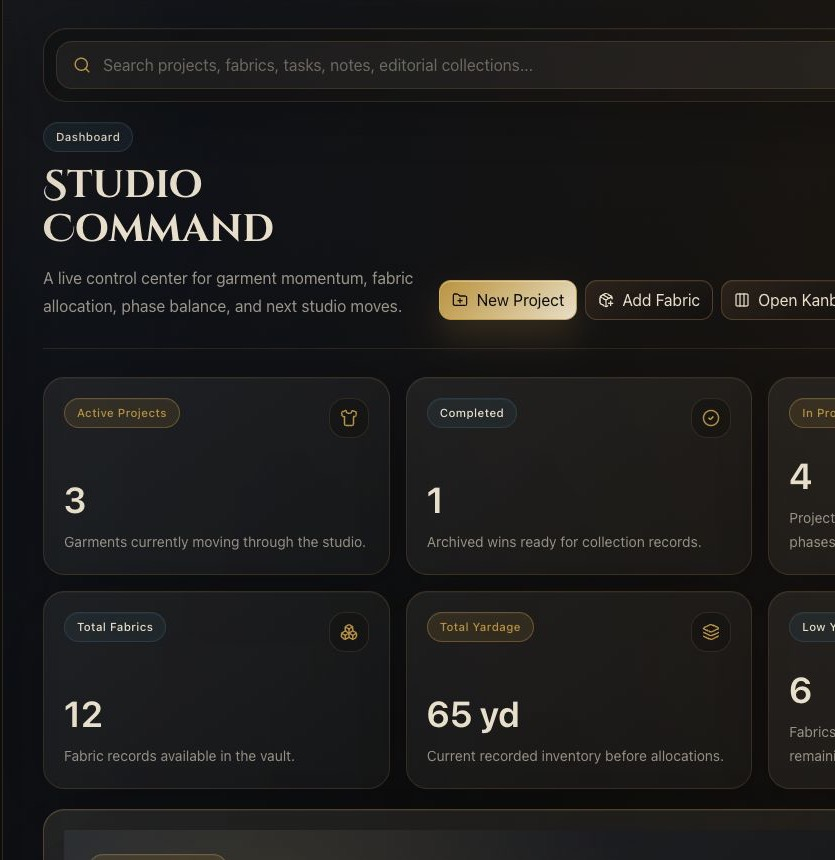
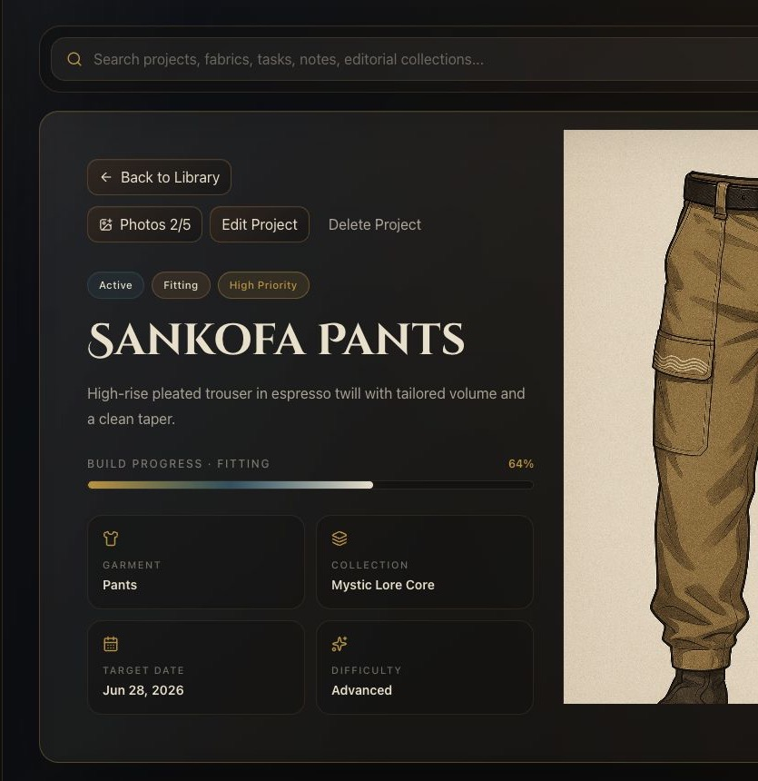
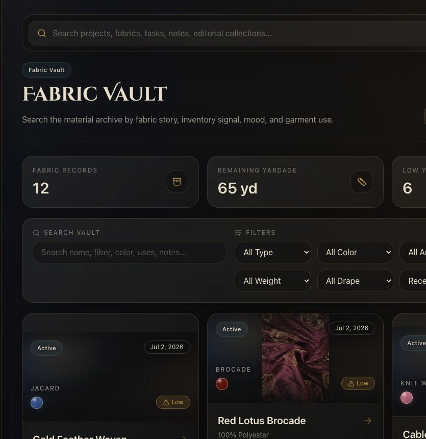
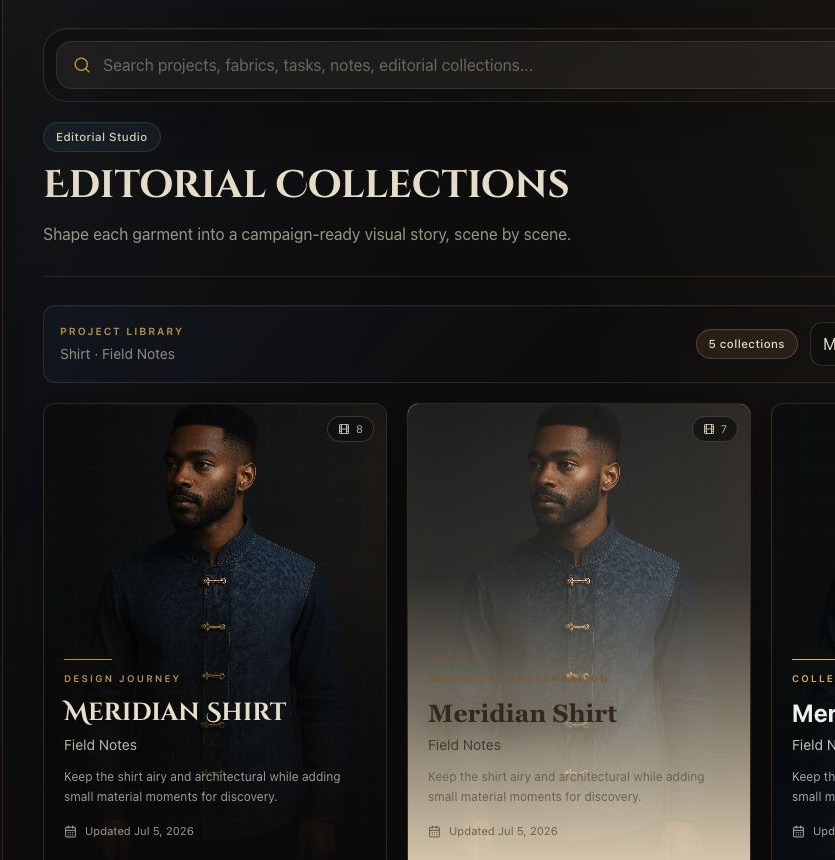

# Mystic Lore Studio

Mystic Lore Studio is a private apparel studio workspace for building garments,
editorials, notes, fabrics, images, and project development. It combines project
management, fabric inventory, cloud image sync, editorial presentation tools, and
a recruiter-facing portfolio layer into one cohesive fashion-product workflow.

This repository is public for portfolio and hiring-review purposes. The code is
not open source; see [LICENSE.md](LICENSE.md) for the portfolio-review license.

## Why I Built It

I built Mystic Lore Studio to solve a real studio problem: apparel projects are
visual, material-heavy, and process-heavy, but most task tools flatten that work
into generic lists. Mystic Lore Studio treats each garment like a living dossier:
design intent, construction phases, fabric decisions, images, notes, editorials,
and public presentation all stay connected.

The project also became a practical way to demonstrate product thinking,
frontend architecture, responsive UI craft, offline-first data handling, Supabase
integration, and AI-assisted development workflow on a real, evolving product.

## Product Highlights

- **Studio dashboard:** active project signals, featured garment hero, progress,
  phase summaries, and quick navigation across the studio.
- **Project dossiers:** garment profiles with adaptive image presentation,
  gallery carousel, materials, tasks, notes, status, progress, and responsive
  editing flows.
- **Fabric Vault:** inventory records with yardage tracking, textile specs,
  fabric image handling, color systems, and a GSM/OZ weight guide.
- **Editorial Collections:** scene-based presentation builder with templates,
  themes, block editing, cinematic viewer, book mode, PDF export, and scene image
  export.
- **Cloud sync foundation:** Supabase Auth, RLS-protected tables, private Storage
  images, local fallback cache, IndexedDB image previews, and offline mutation
  recovery.
- **Portfolio mode:** private controls for selecting public projects and
  recruiter-facing case study pages generated from sanitized snapshots.

## Screenshots / Demo

The screenshots below are captured from the working app and are intended to show
product scope, interaction density, and visual polish.

There is no production demo link included in this repo. Hiring reviewers can run
the local demo with the setup steps below using `.env.example` as the safe
environment template.



*Dashboard: a studio control center with project signals, featured garment
presentation, and progress context.*



*Project dossier: responsive garment profile, adaptive imagery, metadata, and
supporting project photography.*



*Fabric Vault: material archive, yardage planning, textile metadata, search, and
inventory-focused cards.*



*Editorial Collections: presentation tooling for building lookbooks, campaign
stories, and exportable collection narratives.*


*Portfolio: public-facing recruiter view generated from selected studio content
without exposing private project data.*

## Tech Stack

- React 19
- TypeScript
- Vite
- Tailwind CSS
- Supabase Auth, Postgres, RLS, and private Storage
- LocalStorage and IndexedDB for offline/cache behavior
- PWA service worker
- jsPDF, JSZip, and html-to-image for export workflows
- Lucide React icons

## AI-Assisted Development Workflow

This project was built through an iterative AI-assisted engineering workflow. I
used AI as a product, design, and coding collaborator while retaining human
direction over feature scope, UX decisions, data safety, testing priorities, and
final implementation choices.

The workflow included:

- writing feature plans and acceptance criteria before implementation;
- using AI to explore the codebase, draft implementation approaches, and
  identify edge cases;
- manually reviewing and refining generated code;
- running builds, browser QA, responsive checks, and sync troubleshooting;
- evolving the product through real usage feedback across desktop, iPad, and
  mobile.

## Local Setup

Copy the placeholder environment file and add your own Supabase values locally:

```bash
cp .env.example .env.local
```

`.env.local` is ignored by Git and should contain real local credentials. Do not
commit real keys.

```bash
npm install
npm run dev
npm run build
```

The app can run with local browser persistence even before Supabase is
configured. Cloud sync requires the Supabase migrations below and the two Vite
environment variables in `.env.local`.

## Environment Variables

Use `.env.example` as the safe template:

```bash
VITE_SUPABASE_URL=https://your-project-ref.supabase.co
VITE_SUPABASE_ANON_KEY=your-supabase-anon-key
# Optional: set this after deployment to copy absolute public portfolio links.
# VITE_PUBLIC_APP_URL=https://your-deployed-app.example
```

The actual `.env.local` file is intentionally ignored. The repo should never
contain service-role keys, private database URLs, or real API secrets.

If `VITE_PUBLIC_APP_URL` is not set, the Portfolio share tools copy relative
paths such as `/portfolio/your-name`.

## Supabase Configuration

Mystic Lore Studio currently keeps local browser persistence active. Supabase is
the primary data source for authenticated users. A compact, user-scoped
localStorage cache plus an IndexedDB mutation queue, image-preview store, and
upload-blob store keep the app usable when Supabase is temporarily unavailable.

Required Vite environment variables:

```bash
VITE_SUPABASE_URL=https://your-project-ref.supabase.co
VITE_SUPABASE_ANON_KEY=your-supabase-anon-key
```

For local development, add these values to `.env.local` in the project root.
Restart `npm run dev` after changing environment variables.

For Netlify, add the same variables in:

```text
Site configuration > Environment variables
```

After updating Netlify environment variables, trigger a new deploy so Vite can
include the values in the client build.

### Manual Supabase Setup

The migrations are additive and safe to rerun after a partial SQL Editor run.
They do not drop app tables or delete existing records. In the Supabase
Dashboard, open **SQL Editor**, create a new query for each step, paste the
complete file contents, and run the files in this order:

1. **Run migration 001 / foundation schema:**
   `supabase/migrations/20260617010000_create_mystic_lore_schema.sql`
2. **Run the cloud and Storage migrations:** first
   `supabase/migrations/20260621010000_add_cloud_sync_and_storage.sql`, then
   `supabase/migrations/20260628010000_add_sync_tombstones.sql`, then
   `supabase/migrations/20260707010000_add_portfolio_profile.sql`.
3. **Verify tables:** open **Table Editor** and confirm `profiles`, `projects`,
   `fabrics`, `materials`, `tasks`, `notes`, `project_images`,
   `yardage_entries`, `lookbook_pages`, and `sync_tombstones` exist.
4. **Verify image Storage:** open **Storage** and confirm the private
   `project-images` bucket exists. Do not make this bucket public.
5. **Retry the app:** return to Mystic Lore Studio, open the sync status panel,
   and choose **Retry Sync**. Refresh or refocus other signed-in devices after
   the first successful sync.

The Storage policies restrict every object to the authenticated owner's path:
`users/{userId}/...`. The database tables have Row Level Security enabled and
authenticated users can only read or change rows where `auth.uid() = user_id`.

#### Setup Troubleshooting

- **`relation ... already exists`:** use the current migration files from this
  repository and rerun the same step. Their tables and indexes use `if not
  exists`, so a completed statement from a partial run is preserved.
- **`policy ... already exists`:** use the current file and rerun it. Each
  migration drops only its named policy before recreating it; no table data is
  removed.
- **Bucket already exists:** rerun the Storage migration. It keeps
  `project-images` private, refreshes its limits, and safely recreates the
  owner-path policies.
- **Cloud sync needs attention:** confirm all four migration files completed,
  both Supabase environment variables point to the same project, and the
  `project-images` bucket is private. Then sign in again and choose **Retry
  Sync**.
- **Intentionally resetting a broken development project:** only then run
  `supabase/dev_reset_mystic_lore.sql`. That file permanently deletes all
  Mystic Lore cloud rows and images before you rerun the migrations. Never use
  it as part of normal setup.

### Required Database Objects

Apply the SQL migrations in `supabase/migrations` in timestamp order. The sync
layer expects these user-owned tables with Row Level Security enabled:

- `profiles`
- `projects`
- `tasks`
- `notes`
- `fabrics`
- `materials`
- `yardage_entries`
- `project_images`
- `lookbook_pages`
- `sync_tombstones`

Every synced row includes `user_id`, a UUID primary key, and a unique
user-scoped `client_id`. The browser continues using its existing stable string
IDs while Supabase UUIDs remain internal to database relationships. Frontend
queries always use the authenticated user and never require a service-role key.

### Private Image Storage

The follow-up sync migration creates a private Supabase Storage bucket named:

```text
project-images
```

Project and lookbook images use:

```text
users/{userId}/projects/{projectId}/{imageId}.webp
```

Fabric Vault images use:

```text
users/{userId}/fabrics/{fabricId}/{imageId}.webp
```

Storage policies only permit authenticated users to access objects beneath
their own `users/{userId}` path. The app generates short-lived signed URLs for
display and refreshes them when the app regains focus or a URL expires.

### Migration and Offline Behavior

When an authenticated account has no cloud records, the app checks the current
device for meaningful local data. Untouched bundled demo data is ignored. If
user-created or edited data exists, the app offers a one-time migration that:

- upserts projects and related records using stable `client_id` values;
- converts legacy Base64 project, lookbook, and fabric images to WebP;
- uploads media to the private Storage bucket;
- verifies and moves the legacy localStorage dataset into IndexedDB as a
  recovery backup before removing the oversized localStorage copy;
- records migration completion without deleting local data.

Before migration or synchronization starts, the app verifies authentication,
all required tables, Row Level Security access, and the private Storage bucket.
Missing schema, missing bucket, permission, authentication, timeout, and
network failures produce distinct recovery messages.

All edits remain optimistic: React state and the compact user-scoped
localStorage cache update immediately. Base64 image payloads, signed URLs, and
offline previews are excluded from that cache when an IndexedDB or cloud
reference exists. IndexedDB stores small offline previews, optimized upload
blobs, the verified legacy recovery backup, and a durable, versioned queue of
record-level upsert/delete operations. Repeated edits to the same record are
coalesced, parent records are sent before their dependents, database writes use
batches of 50, and no more than two images upload at once.
Database requests time out after 15 seconds and image requests after 45 seconds;
only network failures retry with 1, 2, and 4 second backoff. Confirmed deletes
are retained in `sync_tombstones`, preventing an older device cache from
recreating removed records. A genuinely newer offline edit may restore a record
and clears its older tombstone.

Migration runs in the background after confirmation and reports validation,
record preparation, record saving, image upload, and verification phases. A
migration is complete only after its queue drains and a verification fetch
succeeds. The app retries on browser focus, network reconnect, or the manual
Retry Sync action. Conflicts are resolved using the newest `updated_at` value.
Missing Storage objects are repaired per image instead of failing the complete
studio refresh. The legacy localStorage copy is removed only after its IndexedDB recovery backup
has been read back and verified byte-for-byte. A local cache quota warning does
not turn a successful cloud sync into a cloud sync error.

## MVP Status

Status: MVP feature foundation in progress.

Authenticated sessions use Supabase as the cloud source of truth with local
cache and offline queue recovery. Cloud sync requires every repository SQL
migration to be applied to the configured Supabase project in timestamp order.
