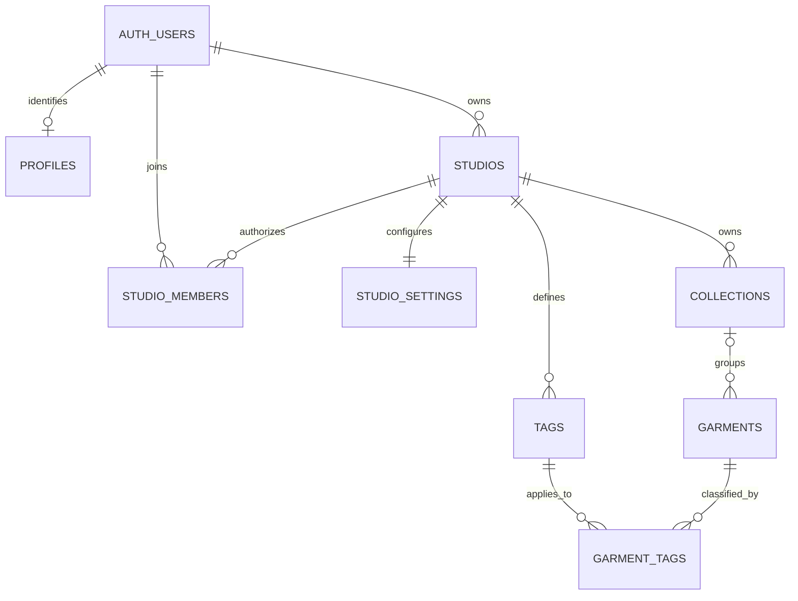
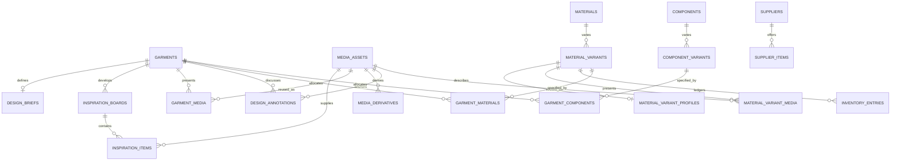
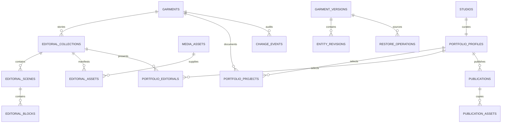
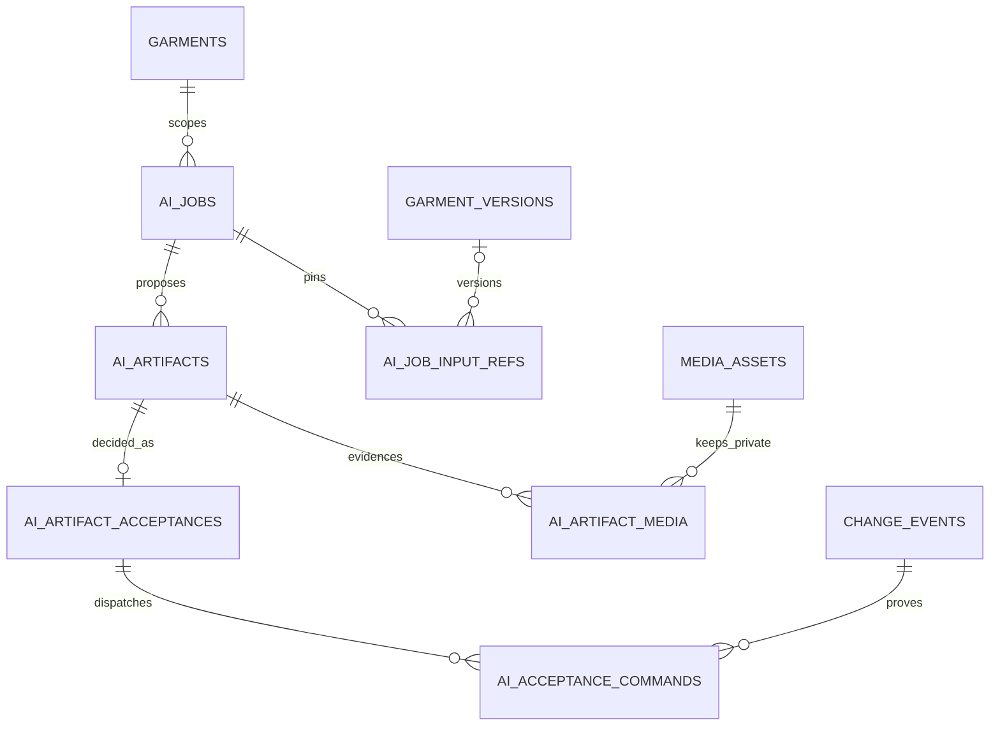

# Mystic Lore Studio 2.0 Canonical Schema

Status: 2.0 release-candidate schema audited. The migrations and database
policy suites pass locally; release remains blocked on the application-layer
canonical persistence cutover documented in the RC release report.

Source specification: Product Bible pages 28, 31-32, 34-35, 40-41, 56-57,
and 59-60, together with the earlier domain sections. The ordered SQL
migrations are authoritative for exact types, checks, foreign keys, indexes,
grants, triggers, and policies.

## Schema Boundary

| Schema | Exposure | Responsibility |
| --- | --- | --- |
| `public` | Existing Data API contract | Legacy tables and legacy public snapshots; unchanged by WP2 |
| `ml_private` | Authenticated Data API only | Canonical Studio 2.0 domain graph protected by membership-derived RLS |
| `ml_public` | Anonymous and authenticated reads | Immutable current Public Cut snapshots and copied derivative manifests |
| `ml_internal` | Not exposed through the Data API | Membership helpers, integrity guards, publication transitions, and audit triggers |

The local Supabase configuration exposes `ml_private` and `ml_public` in
addition to the legacy schemas. Table grants and RLS remain authoritative;
`anon` has no grant on `ml_private`.

## Ownership and Identity



- Every tenant-owned private row carries `studio_id`.
- Every relationship between tenant rows uses a composite
  `(studio_id, foreign_id)` foreign key where applicable. A valid writer who is
  a member of two studios still cannot create a cross-studio relationship.
- `profiles` is the intentional exception: it is person-owned through
  `auth.users.user_id`.
- Creating a Studio inserts one active owner membership and one settings row in
  the same transaction.
- Roles are schema-ready for `owner`, `editor`, `reviewer`, and `viewer`.
  Owners/editors write; all active roles read. Membership UX remains
  single-owner-first during 2.x.
- `garment_code`, Studio slug, portfolio username, project slug, and editorial
  slug are immutable. Canonical clients archive these roots instead of deleting
  them, preventing application-level reuse.

## Complete Domain Inventory

| Domain | Canonical tables |
| --- | --- |
| Identity and catalog | `profiles`, `studios`, `studio_members`, `studio_settings`, `collections`, `garments`, `tags`, `garment_tags` |
| Design and media | `design_briefs`, `inspiration_boards`, `inspiration_items`, `media_assets`, `garment_media`, `media_derivatives`, `design_annotations` |
| Materials and components | `materials`, `material_variants`, `material_variant_profiles`, `material_variant_media`, `inventory_entries`, `garment_materials`, `components`, `component_variants`, `garment_components`, `supplier_items` |
| Technical foundation | `technical_specs`, `technical_flats`, `flat_annotations`, `technical_files`, `tech_pack_exports`, `validation_runs`, `validation_waivers` |
| POM and grading | `pom_points`, `measurement_sets`, `measurement_values`, `grade_rules`, `grade_rule_values`, `fit_measurements` |
| BOM and construction | `bom_items`, `construction_sections`, `construction_steps`, `construction_details`, `technical_templates`, `template_applications` |
| Production | `suppliers`, `factories`, `sample_rounds`, `sample_round_media`, `fit_sessions`, `fit_session_media`, `fit_issues`, `fit_issue_promotions`, `cost_sheets`, `cost_items`, `production_orders`, `production_milestones`, `qc_templates`, `qc_template_checks`, `qc_inspections`, `qc_results`, `qc_waivers` |
| Story and portfolio | `editorial_collections`, `editorial_scenes`, `editorial_blocks`, `editorial_assets`, `editorial_collection_garments`, `editorial_exports`, `portfolio_profiles`, `portfolio_projects`, `portfolio_project_assets`, `portfolio_editorials`, `portfolio_editorial_scenes`, `portfolio_editorial_assets`, `portfolio_technical_excerpts` |
| Versioning and workflow | `garment_versions`, `entity_revisions`, `change_events`, `restore_operations`, `tasks`, `calendar_events`, `sync_tombstones` |
| Governed AI | `ai_jobs`, `ai_job_input_refs`, `ai_artifacts`, `ai_artifact_media`, `ai_artifact_acceptances`, `ai_acceptance_commands` |
| Canonical transport and publication batches | `canonical_operation_receipts`, `public_cut_batches` |
| Public projection | `ml_public.publications`, `ml_public.publication_assets` |

There are 89 canonical private tables and two public projection tables.

## Design, Library, and Media Relationships



Inventory is append-only. Available quantity is derived from ledger entry type
and garment reservations; no manually editable available total exists.
Supplier offers use explicit nullable material/component variant foreign keys
with an exactly-one constraint rather than a polymorphic JSON relationship.
Material imagery is also relational: ordered swatch, detail, and reference roles
point to private canonical media assets. Textile personality and storage details
remain explicit profile columns rather than an opaque JSON document.

## Technical and Production Relationships

```mermaid
erDiagram
  GARMENTS ||--o| TECHNICAL_SPECS : specifies
  TECHNICAL_SPECS ||--o{ TECHNICAL_FLATS : illustrates
  TECHNICAL_FLATS ||--o{ FLAT_ANNOTATIONS : calls_out
  TECHNICAL_SPECS ||--o{ TECHNICAL_FILES : attaches
  TECHNICAL_SPECS ||--o{ POM_POINTS : defines
  TECHNICAL_SPECS ||--o{ MEASUREMENT_SETS : measures
  MEASUREMENT_SETS ||--o{ MEASUREMENT_VALUES : contains
  POM_POINTS ||--o{ MEASUREMENT_VALUES : identifies
  TECHNICAL_SPECS ||--o{ GRADE_RULES : grades
  GRADE_RULES ||--o{ GRADE_RULE_VALUES : contains
  POM_POINTS ||--o{ GRADE_RULE_VALUES : identifies
  TECHNICAL_SPECS ||--o{ BOM_ITEMS : itemizes
  TECHNICAL_SPECS ||--o{ CONSTRUCTION_SECTIONS : structures
  CONSTRUCTION_SECTIONS ||--o{ CONSTRUCTION_STEPS : orders
  CONSTRUCTION_STEPS ||--o{ CONSTRUCTION_DETAILS : annotates
  TECHNICAL_SPECS ||--o{ VALIDATION_RUNS : validates
  VALIDATION_RUNS ||--o{ VALIDATION_WAIVERS : governs
  TASKS ||--o{ VALIDATION_WAIVERS : follows_up
  GARMENTS ||--o{ GARMENT_VERSIONS : freezes
  TECHNICAL_SPECS ||--o{ TECH_PACK_EXPORTS : generates
  GARMENT_VERSIONS ||--o{ TECH_PACK_EXPORTS : reproduces
  GARMENTS ||--o{ SAMPLE_ROUNDS : samples
  FACTORIES ||--o{ SAMPLE_ROUNDS : produces
  GARMENT_VERSIONS ||--o{ SAMPLE_ROUNDS : pins
  SAMPLE_ROUNDS ||--o{ SAMPLE_ROUND_MEDIA : evidences
  SAMPLE_ROUNDS ||--o{ FIT_SESSIONS : reviews
  GARMENT_VERSIONS ||--o{ FIT_SESSIONS : pins
  FIT_SESSIONS ||--o{ FIT_SESSION_MEDIA : evidences
  FIT_SESSIONS ||--o{ FIT_ISSUES : records
  FIT_SESSIONS ||--o{ FIT_MEASUREMENTS : observes
  POM_POINTS ||--o{ FIT_MEASUREMENTS : identifies
  FIT_ISSUES ||--o{ FIT_ISSUE_PROMOTIONS : promotes
  GARMENTS ||--o{ COST_SHEETS : costs
  GARMENT_VERSIONS ||--o{ COST_SHEETS : pins
  COST_SHEETS ||--o{ COST_ITEMS : contains
  COST_SHEETS ||--o{ PRODUCTION_ORDERS : authorizes
  GARMENT_VERSIONS ||--o{ PRODUCTION_ORDERS : releases
  FACTORIES ||--o{ PRODUCTION_ORDERS : manufactures
  PRODUCTION_ORDERS ||--o{ PRODUCTION_MILESTONES : schedules
  QC_TEMPLATES ||--o{ QC_TEMPLATE_CHECKS : defines
  PRODUCTION_ORDERS ||--o{ QC_INSPECTIONS : verifies
  QC_TEMPLATES ||--o{ QC_INSPECTIONS : applies
  QC_INSPECTIONS ||--o{ QC_RESULTS : records
  QC_RESULTS ||--o| QC_WAIVERS : excepts
  TASKS ||--o{ QC_WAIVERS : follows_up
```



The Studio setting establishes the preferred measurement unit. Each technical
spec records that owning unit; display/export conversion is explicit and
measurement rows do not silently mix units. Money uses exact numeric values
plus constrained three-letter currency codes.

## Story, Versioning, and Public Cut



`ml_public.publications` contains the immutable sanitized snapshot and media
manifest. Source IDs remain normalized foreign keys but do not grant access to
the private source. Anonymous RLS requires all of `is_public`, `is_current`, and
`unpublished_at is null`. Historical rows remain owner-readable.

Publication is staged as a private draft, copied derivatives are registered and
uploaded, then the guarded publication command makes the snapshot current.
Unpublication requires copied public objects to be removed first, marks the
snapshot non-current/non-public, retains private source and publication history,
and records an immutable change event.

The public payload trigger recursively rejects private-only keys including
costs, supplier/factory identifiers, technical source files, fit evidence,
model profiles, raw AI input references/prompts, private notes, and private
storage paths. The WP8 allowlisted publication builder constructs the positive
public contract and never queries the governed AI graph.

## Governed AI Relationships and Commit Boundary



AI input references are normalized and revision-pinned. Candidate payload,
review-field manifest, provenance, contextual confidence, and checksums are
immutable provider evidence. An owner or editor may accept only a fresh candidate. Acceptance
calls the same typed domain command used by the manual surface, then records
one receipt per selected field against the resulting append-only change event.
The database rejects acceptance without those normal domain events. Rejection
is audited and creates no domain mutation.

Authenticated browser clients may enqueue jobs and inspect private candidates,
but provider artifact creation, provider-status transitions, acceptance rows,
and command receipts are not browser-writable. Generated media must use
`studios/{studio_id}/...`; public storage paths are rejected. The normal test
suite uses a deterministic fake provider and makes no paid model call.

## Storage Contract

| Bucket | Visibility | Canonical path | Write rule |
| --- | --- | --- | --- |
| `studio-assets` | Private | `studios/{studio_id}/{assets|derivatives|technical|samples|editorial|exports}/...` | Active owner/editor of the path Studio |
| `portfolio-assets` | Public direct download; anonymous listing denied | `publications/{publication_id}/{publication_asset_id}/{filename}` | Active owner/editor and a matching draft `publication_assets` row |

The existing `project-images` and `portfolio-images` buckets are untouched.
Private clients use signed URLs for canonical private objects. Public assets are
copies, never aliases of private source objects.

## JSONB Policy

JSONB is limited to the Product Bible's extensible settings, visual layouts and
anchors, template mappings, validation/AI results, reversible patches, and
immutable snapshots. Catalog, garment, media, supplier, technical, production,
portfolio, and publication relationships use columns and foreign keys.

## Migration and Verification

Ordered migrations:

1. `20260824051228_ml_studio_2_canonical_schema.sql`
2. `20260824051237_ml_studio_2_rls_and_publication_boundary.sql`
3. `20260824051247_ml_studio_2_storage_policies.sql`
4. `20260824070629_enable_canonical_migration_bootstrap.sql`
5. `20260825035858_add_technical_foundation_contracts.sql`
6. `20260825051344_enforce_pom_measurement_integrity.sql`
7. `20260825184506_complete_wp4_bom_construction_release_pack.sql`
8. `20260825203246_implement_wp5_freeze_frames_restore.sql`
9. `20260826061816_implement_wp6_production_sampling_fit.sql`
10. `20260826080100_complete_wp6_costing_orders_qc.sql`
11. `20260826103000_normalize_editorial_story_from_system.sql`
12. `20260826121000_implement_wp8_public_cuts.sql`
13. `20260827170000_enable_trusted_rc_migration_role.sql`
14. `20260827213019_implement_wp9_governed_ai_candidates.sql`
15. `20260828014454_canonical_operation_transport.sql`
16. `20260828021002_atomic_public_cut_batch.sql`
17. `20260828033000_protected_canonical_commands.sql`
18. `20260828050000_trusted_device_import_finalize.sql`
19. `20260830073211_wp11g_material_visual_recovery.sql`

The release-candidate migration role is deliberately narrower than an
application role: it can read and upsert canonical private rows for a trusted,
server-side migration, cannot delete those rows, can only read public
projections, and has no access to `ml_internal`.

Verification commands:

```bash
npm run validate:schema
npm run db:start
npm run db:reset
npm run test:db
npm run test:rc:migration
npm run test:canonical:integration
npm run test:e2e
npm run test:a11y
npm test
npm run build
npm run test:bundle
```

`validate:schema` is deterministic and verifies the table inventory, tenant
columns, allowed JSONB fields, RLS/storage coverage, migration order, pgTAP
plan, WP3-WP9 canonical route boundaries, and checksums of all six legacy
migrations plus the WP0 fixture. `test:db` executes the 230-assertion pgTAP
matrix on a local or explicit test database.

## Studio 2.0 Canonical Transport and Public Batch Contract

The browser does not issue arbitrary table writes in shadow or cloud mode.
Pure domain commands produce a `CanonicalOperation`; the
`commit_canonical_operation` security-invoker RPC maps each entity through a
static table/column allowlist, preflights every expected revision, applies the
complete group, records database-derived before/after events and deletion
tombstones, and stores an append-only request-checksummed receipt. Reusing an
operation ID with the same request is a duplicate success; reusing it with a
different request is rejected.

The private `public_cut_batches` table records an anonymous-invisible draft and
its expected derivative paths. Fresh source validation precedes the batch;
copied rights-cleared objects are staged before one transaction promotes the
entire snapshot set and retires its predecessor. Unpublish removes anonymous
row visibility before returning paths for retryable Storage cleanup.

Dedicated commands own Freeze Frame/restore, release/export, QC, and governed
AI transitions. The service-only trusted device finalizer exists solely to
restore circular version/validation pins after an isolated beta import.

## WP2B Transition Contract

`src/domains/migration` adds the typed, non-UI transition layer:

- deterministic UUIDv5 identity mapping and canonical row batches;
- dependency-ordered, retry-safe execution against in-memory or injected
  authenticated Supabase stores;
- offline queue and tombstone replay with surfaced scalar conflicts;
- checksum-based media deduplication with separate usage relationships;
- private portfolio case-study snapshots without public publication rows;
- legacy read-through for notes, device settings, and lookbook ownership that
  is intentionally deferred to later work packages.

The committed machine report is
`docs/implementation/evidence/wp2/legacy-studio-data-v5.migration-report.json`.
It is regenerated in memory and compared byte-for-structure by the application
tests, preventing stale row counts, mappings, warnings, or checksums.

## WP3 Route Cutover

`CanonicalWorkspaceProvider` coordinates the accepted migration graph with the
Supabase-backed canonical repository. The Garment Library, garment
overview/Design Studio, Material Vault, Component Library, and later WP4–WP9
surfaces call this repository instead of reading legacy project, fabric, or
linked-material arrays. IndexedDB is cache/outbox/recovery only; the normalized
private graph is no longer stored in localStorage.

Legacy project/fabric routes remain compatibility aliases only. Their old page
components and `StudioDataProvider` are not mounted by normal authenticated
routing. Legacy records remain available only to migration and recovery tools.

## WP4a Technical Studio Contract

The additive `add_technical_foundation_contracts` migration completes fields
needed by the first working Technical Studio segment:

- `flat_annotations.severity` and `flat_annotations.status` support critical
  issue gates without encoding workflow state into canvas pixels;
- `tech_pack_exports` retains `template_id`, `template_version`,
  `source_revision_label`, and `deterministic_filename` beside its immutable
  source garment version and checksum;
- `technical_templates.template_type` admits the `tech_pack` export template;
- the partial `(studio_id, flat_id)` index covers unresolved critical callouts.

The typed technical repository owns commands for spec creation, source-mapped
flat revision registration, structured annotations, approval, validation runs,
comparison preparation, garment Technical checkpoints, and export records.
Original source bytes and generated ZIP bytes are durable offline blobs with
canonical private Storage target paths. Front and Back are the initial required
view set. BOM and construction remain unused until their dedicated segment.

## WP4b POM, Measurement, Fit, and Grading Contract

`technical_specs.unit` is the only stored unit for a specification. POM
targets, asymmetric tolerances, grade deltas, and sample actuals are persisted
in that unit; millimeter, centimeter, and inch alternatives are explicit display
conversions. POM rows own normalized anchors, names, and methods independently
of their canvas rendering.

The `enforce_pom_measurement_integrity` migration adds normalized-anchor,
non-blank identity, non-negative target/actual, and size constraints plus
POM-centered target, grading, and fit lookup indexes. Existing Studio-derived
RLS covers these already-canonical private tables.

The measurement repository provides atomic CSV validation/import, inclusive
tolerance evaluation, sample variance, grading previews and non-destructive
graded-set commits. Technical checkpoints now snapshot POM, measurement-set,
measurement-value, grade-rule, and grade-delta structure. Comparison is keyed
by stable POM and set/POM/size identity. Selective restore updates only chosen
rows, records a restore operation with a new checkpoint, and never removes fit
measurements created after the source checkpoint.

## WP4c BOM, Construction, Release, and Export Contract

The `complete_wp4_bom_construction_release_pack` migration completes the
structured release surface:

- BOM rows use stable material/component variant relationships, optional
  supplier-offer and substitute links, or an explicit intentional-free-text
  state. Quantity, unit, placement, lifecycle status, shortage, and exact cost
  impact remain queryable columns.
- Construction sections, steps, and callouts retain stable sort identity.
  Machine, stitch/seam specification, required flags, asset anchors, and detail
  resolution status are structured records rather than rendered pixels.
- A technical spec records its released source version, validation run, actor,
  time, protected checkpoint, and evidence. Release waivers are separate
  member-readable audit rows; the database constraint excludes privacy-domain
  waivers and clients receive no direct mutation grant.
- An approved tech-pack export records the pinned source garment version,
  ruleset/template versions, deterministic filename, checksum, private Storage
  path, generation/approval evidence, and ordered section manifest.

The release repository owns atomic BOM and construction commands, template
capture/application, grouped validation, governed waiver creation, release
commit, and deterministic export. Export consumes the released checkpoint,
stable-orders structured JSON and ZIP entries, fixes archive timestamps, and
includes stored source bytes. Repeated export of the same release and template
is byte-identical. AI integrations can only submit candidates to these commands;
they cannot write technical or released records directly.

## WP5 Change Ledger, Freeze Frame, and Restore Contract

The `implement_wp5_freeze_frames_restore` migration makes the versioning roots
operational rather than descriptive:

- Freeze Frames add decision notes, named/release/restore kind, fresh base
  revision, validated domain scope, garment-local parent identity, and
  checksum lookup. Parent/current foreign keys restrict deletion.
- Change events add scope and base/result revisions. Entity revisions, change
  events, and restore operations reject update and delete. Release, export,
  order, and publication references protect their source Freeze Frame.
- Restore operations retain selected keys, downstream dependencies, preview
  checksum, replay/inverse patches, actor, source/result versions, and
  base/result revision.
- Authenticated command wrappers create a Freeze Frame or commit a restore only
  after Studio-write authorization and a row-locked expected-revision check.
  Internal helpers pin an empty search path and are not exposed as Data API
  schemas.
- A publication transition rejects a non-current source Freeze Frame. Existing
  immutable Public Cuts are unaffected by working-state restore.

The typed versioning repository mirrors these invariants for the current
canonical browser workspace. Structural comparison addresses stable field and
row identity, POM and measurements, BOM substitution/cost, construction order,
media checksums, editorial live-data staleness, and portfolio selection.
Restore uses a hashed preview then creates a new child frame and append-only
audit evidence. Media rows and later fit actuals are intentionally not removed
by scoped restore.

## WP6a Sourcing, Sampling, and Fit Contract

The additive `implement_wp6_production_sampling_fit` migration completes the
first Production segment without implementing costing, orders, or QC:

- supplier capability and MOQ fields plus factory supplier/contact/capability
  relationships support reusable sourcing identity;
- sample rounds, sessions, measurements, and issues are pinned to the same
  garment Freeze Frame; trigger guards reject cross-garment version or POM
  references;
- `sample_round_media` and `fit_session_media` map private media assets to
  explicit evidence roles, ordering, queue/failure state, and retry count;
- `fit_issue_promotions` preserves source issue/session/sample/version lineage
  while creating a task, non-writing POM adjustment candidate, construction
  callout, or version note;
- all new evidence tables use authenticated grants plus the established
  membership-derived RLS policies, and every source/version/POM query has a
  tenant-first index.

The typed production repository mirrors these rules in the canonical browser
workspace. Production Home creates only version-pinned rounds. Fit Review uses
the exact session source for actuals, issues, gallery captures, decisions, and
promotions. Local mobile captures queue in private storage paths and retain
retry state across reload. Freeze Frame production snapshots include this
evidence, while scoped restore keeps physical sample and fit records immutable.

## WP6b Costing, Orders, QC, and Timeline Contract

The additive `complete_wp6_costing_orders_qc` migration completes Production:

- cost sheets pin a release, ISO currency, quantity basis, COGS, wholesale,
  margin, approval actor, and time; line items separate per-unit and per-order
  cost behavior and may link BOM/material/component identities;
- production orders require an approved same-version cost sheet and released
  technical source. A guard makes the pinned version immutable;
- `production_milestones` provides normalized owner/date/status chronology;
- versioned `qc_templates` and `qc_template_checks` apply through a pinned
  `qc_inspection`; result evidence and issue tasks use explicit foreign keys;
- append-only `qc_waivers` require actor, reason, time, affected rule, and
  follow-up task. Required failed checks block release until passed or waived;
- approval, waiver, decision, and order-status triggers append change events.

The production route now contains Samples & Fit, Cost Sheet, Order & QC, and
Timeline views. Quantity scenarios are keyboard-accessible, wide tables retain
a horizontal fallback, empty/error/retry messages remain visible, and stale
orders explain that later design edits never repoint their source version.
